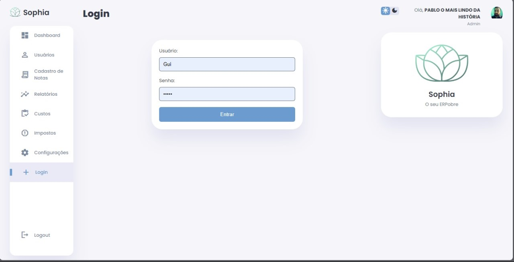
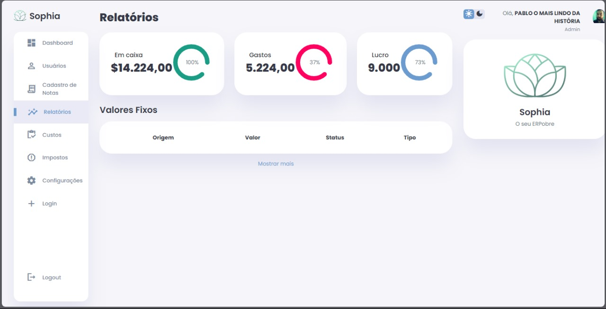

# Sophia - Low-Cost ERP for Small Businesses

## Overview

Sophia is a Flask-based Enterprise Resource Planning (ERP) software designed to assist small business owners in organizing their operations. This low-cost ERP, currently in development, focuses on improving internal processes and integrating activities across different sectors, such as sales and finance, in one centralized platform.

## Features

- Dashboard tabs for quick access to key metrics.
- Invoice registration for managing financial transactions.
- Reports to analyze business performance.
- Cost tracking to monitor and control expenses.
- Tax management for compliance with tax regulations.

## Installation

To install Sophia, follow these steps:

1. Clone the repository:

    ```
    git clone https://github.com/gvlk/AIC-III.git
   
2. Navigate to the project directory:

    ```
    cd AIC-III

3. Install dependencies:

    ```
    pip install -r requirements.txt
   
## Usage
Run the Flask application using

    flask --app sophia run. 

Access the application in your browser at the provided URL.

## Configuration
There are currently no configuration options for the application.

## Contributing
Feel free to contribute to the project by making suggestions or providing feedback. We welcome your input to make Sophia even better!

## License
This project is part of a graduate project and is currently free for use without any specific license.

## Contact
For any inquiries or collaboration, please contact the project contributors.

Guilherme Azambuja (guilhermevazambuja@gmail.com)

## Screenshots


*Login screen*


*Reports screen*
